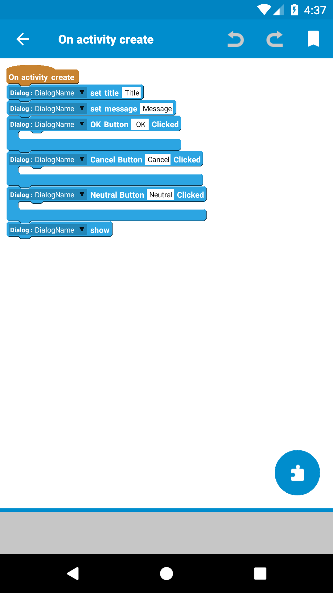
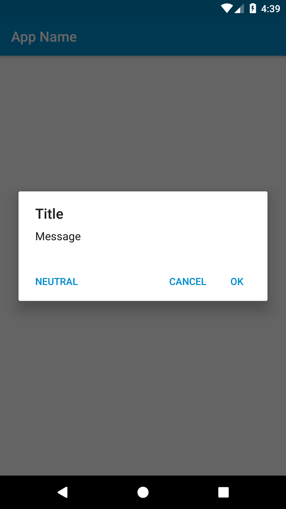
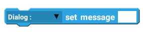
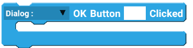
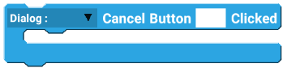
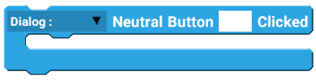
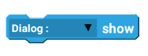

# Dialog

 This page is finished

## Basic Example








## Blocks

#### Set title:

Sets the title for the specified dialog.

#### Set message:

Sets the message for the specified dialog.

#### OK Button clicked:

Runs the blocks inside when specified name of the OK button is clicked.



## Blocks

#### Set title

Sets the specified title for the specified dialog.

#### Set message

Sets the specified message for the specified dialog.

#### OK Button Clicked

When the specified button that is in the OK position is clicked, run the blocks inside for the specified dialog.

#### Cancle Button Clicked

When the specified button that is in the Cancel position is clicked, run the blocks inside for the specified dialog.

#### Neutral Button Clicked

When the specified button that is in the Neutral position is clicked, run the blocks inside for the specified dialog.

#### Dialog show

Shows the specified dialog.

