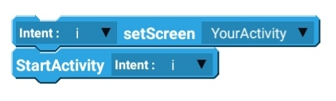
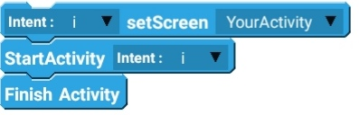

# Intent

## Examples

### Basic Examples

#### Start a Activity


This is not closing the activity that was started previously.


#### Start a Activity and close the previous one


This will close the Activity that was started previously.


## Blocks

### setData

Used to point to the location of a data object \(like a file for example\), while putExtra adds simple data types \(such as an SMS text string for example\).

### setScreen

Sets the screen to navigate to.

### **putExtra**

 Pass data to another Activity. After you pass the data, you retrieve the data using the `Activity getExtra key []` block.

### setFlags

Change the behavior of an activity.

1. `SINGLE_TOP` — Organizes the views in a way that if the view you’re about to transition to was already called before, it would bring that view to the top rather than putting another copy on the top.
2. `CLEAR_TOP` - Clears all the previous views.

### startActivity

Start a new activity. 

