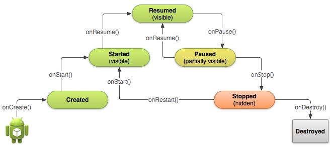
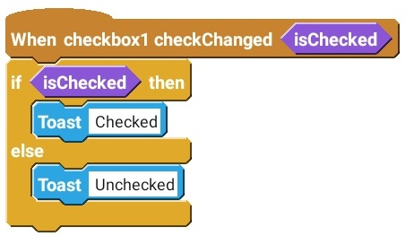

# Events

##  Activity

Source: [https://medium.com/sketchware/activity-lifecycle-in-android-applications-1b48a7bb584c](https://medium.com/sketchware/activity-lifecycle-in-android-applications-1b48a7bb584c)

###  onCreate

This is the event, when app is started. This is a good place to initialize any data such as variables or lists. In Sketchware, this event is provided by default.

###  onBackPressed

As the name suggests, the blocks in this event will run when back button is pressed from your phone.

###  onStart

This event occurs when you open/reopen the activity. See the Pic.9 for more details.

###  onPostCreate

This event is called when activity start-up or onStart is complete.

###  onResume

This event is called whenever the user returns to the activity after leaving the activity — such as receiving a call, pressing the home button, turning off the screen, or transitioning to another activity.

###  onPause

This event occurs when the user is leaving your activity.

###  onStop

When your activity is no longer visible to the user. This is usually a good point to pause any ongoing process, such as MediaPlayer or SoundPool.

###  onDestroy

When the activity is closed, this will last event of Activity. It also occurs when somebody close the app correctly. \(Force close can be exception\)

##  View

###  onClick

A simple Event when that specific widget is clicked.

###  onTextChanged

Whenever the text in 'edittext' is changed.


**onTextChanged** also occurs when you set text by using blocks


###  onCheckChanged

This event occurs when the value of Checkbox/Switch is changed.


**onCheckChanged** also occurs when you change check by using blocks


###  onProgressChanged 

This event occurs when progress is changed for seekbar. \(Only for Seekbar\)

###  onStartTrackingTouch

This event occurs when the user holds the seekbar to change it. \(Only for Seekbar\)

###  onStopTrackingTouch

This event occurs when the user stop holding the seekbar when he is done. \(Only for Seekbar\)

MAPVIEW will be added soon.

###  onDateChange

This event occurs when the user selects a date in a CalendarView. \(Only for CalendarView\)

