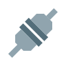
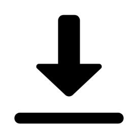

# Configuration

## Library

Get to the Library Manager by tapping ⋮ , then tap Library.

####  AppCompact and Design

Activate the App Compact library to add Drawer layouts, and Floating Action Buttons \(FAB\) to your activities. 


Go to the View Manager to [add a drawer or FAB](https://wiki.sketchub.in/configuration/view#2-select-what-you-want-to-add-to-your-view) to your activity.


####  Firebase

Enable the Firebase library to get access to the Firebase components.


Check the [official Sketchware guide](https://docs.sketchware.io/docs/firebase-getting-started.html) for how to set up Firebase. 


 AdMob

Use Google AdMob in your app. But do you really want to add ads to your app? 


If you make money from ads added to your app, support the developers of Sketchware by purchasing a premium subscription. 


 GoogleMap

Enables the use of the MapView widget.


You don't _need_ to enter the api key to use the GoogleMap library.


## View Mananger

Get to the View Manager by tapping ⋮ , then tap View.

Add a view by pressing the red + button at the bottom right of your screen.

> Fact:  In android, that button is called a FAB.

#### 1. Enter the view's name. 


Enter something memorable, for example signup if this is a page for signups.


#### 2. Select what you want to add to your view


This is where you can add a drawer or FAB. Note, you must have  [AppCompact and Design](https://wiki.sketchub.in/configuration/library#appcompact-and-design) library enabled to add a drawer of FAB.


#### 3. Select screen orientation


_Both_ works best for most apps.


#### 4. Select the default state of the keyboard when an editText widget is present.


The keyboard will always pop up when an [editText ](https://wiki.sketchub.in/widgets-and-layouts/widgets-and-layouts#edittext)is pressed unless the editText is [disabled](https://wiki.sketchub.in/widgets-and-layouts/properties#enabled).


## Recources

You can add Images, Sounds, and Fonts for your application using resource managers.

Recource managers are accessible by taping ⋮ 

### Adding your resource

Tap the red + button at the bottom of the screen.

Once you select your resource, enter the resource name in the space below. If you check the _Add to My Collection_ checkbox, you will be able to access the resource from all your projects by going to the _My Collection_ tab.

Tap save to add your resource.

### Importing Icons \(Image Manager\)

Tap thebutton at the top.

Find your icon and change the name if necessary.

Tap save to add your icon.

### Deleting

Tap thebutton at the top.

Tap the resources you want to delete.

Tap delete.


Deleting resource from Sketchware doesn't delete them from your device, nor does deleting resourcefrom your device delete them from Sketchware.


## Show Source Code

Get to Show Source Code by tapping ⋮ , then tap Show Source Code.

## Collection Manager

Get to the Collection Manager by tapping ⋮ , then tap Collection.

