# Properties


On this page widgets and layouts will be refired collectively as widgets.


Open the properties of a widget by clicking on that widget:

You can also see a complete list of properties by clicking the widget and clicking _see all_. There are certain properties that can only be changed in the _see all_  list, for example the `enabled` property, or the `single line` property of an edittext.

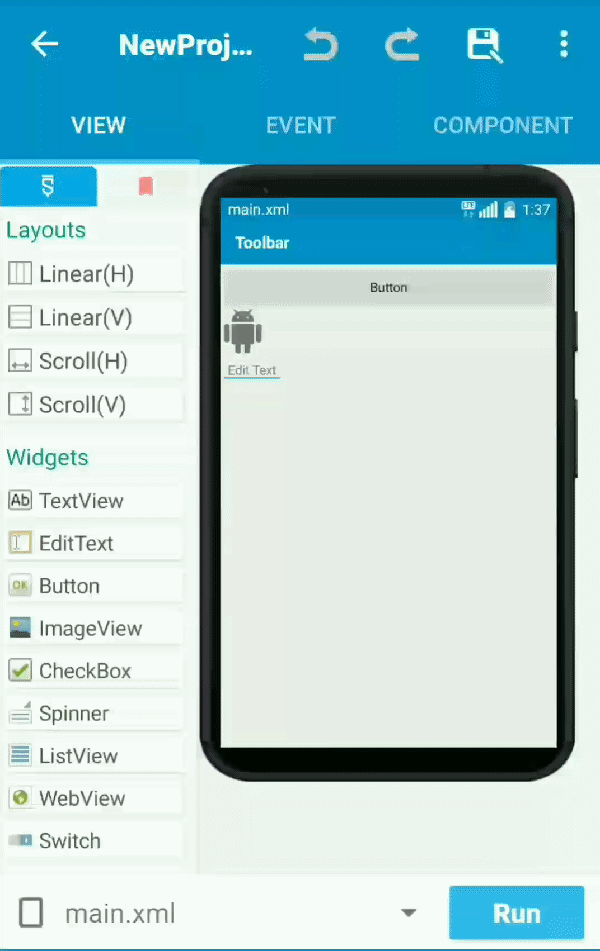

## List of properties

####  Widget ID

This is unique ID of widget or layout you used. While programming the app, it is needed.


For large apps, make your widget's ID rememberable, since this is how you will be able to find widgets when programming your app. For example, for title, "txt\_title", "btn\_submit" etc.


### Layout Properties

#### 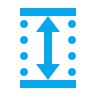 Width and height

You can set your widget's dimensions. There are few types available.

| Type | Explanation |
| :--- | :--- |
| match\_parent | The width/height will be matched to the layout it is inside of, in simple words, it will be maximum height/width. |
| wrap\_content | The width/height will be set automatically according to contents in it. It will only take up what the widget needs. |
| Custom \(in dp\) | Set custom height/width according to requirement. For example, for small icon, you can use 40x40 \(width x height\). Keep in mind that if you used a fixed dp, the widget may be cut off in devices with smaller sized screens. |

####  Padding

Padding is used to add space **inwards** of the widget



Padding is added to "Linear Layout"

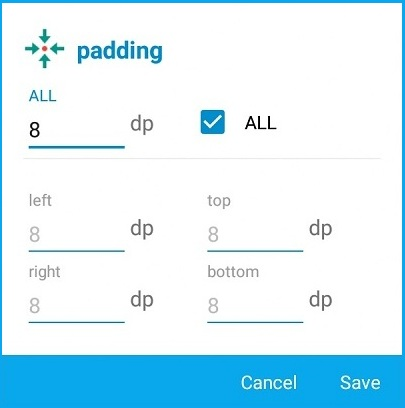



A padding of 8 dp is applied on _Linear Layout_

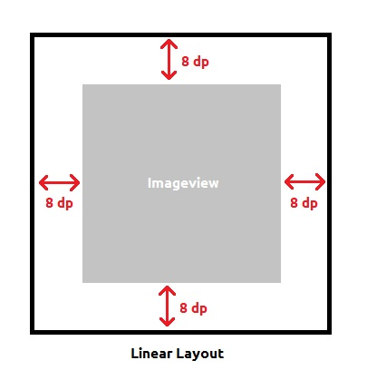



#### 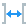 Margin

Margin is used to add space **outwards** of the widget. It is same as [padding](properties.md#padding) but outside of the widget.

####  Gravity and Layout Gravity

In simple word, gravity is used to set alignment of **contents in the widget** whereas layout gravity is used to set alignment of **the widget.**

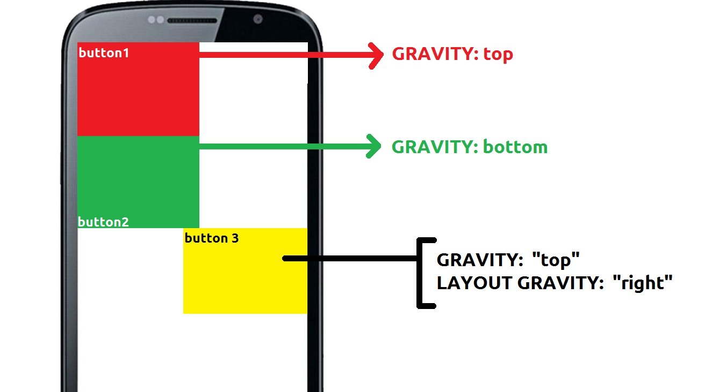

#### \*\*\*\* **Weight**

Weight is very important property, even if it is used rarely. It helps to keep widget stable. It is better that setting a fixed dp, because it will change the widget's size to fit the device it is on. For more information, see [this article](https://medium.com/sketchware/tip-understanding-and-using-weight-property-2d542d2de0bf).  
**Examples:**



It can be used to set width of two or more widgets equal by setting both widgets gravity to 1 \(or any equal value\).




It can be used to fit the widget to screen like this:

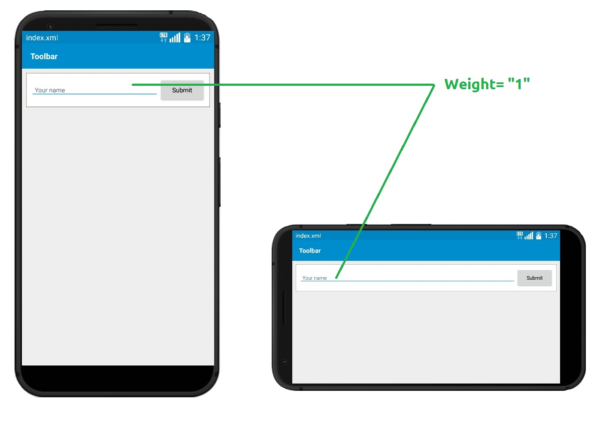



####  Weight Sum

This is one of most unused thing in Sketchware. Nobody has even seen someone using it yet, so there is no information available. You can refer to Stackoverflow if you needed it. [https://stackoverflow.com/a/7452788/9300428](https://stackoverflow.com/a/7452788/9300428)

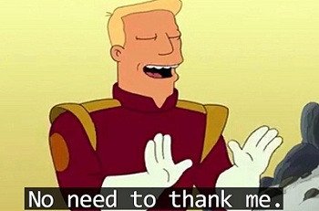

### Text Properties

Text properties are available only for text containing widgets i.e.:

* TextView 
* EditText   
* Button   
* CheckBox   
* Switch   

| Title | Explanation |
| :--- | :--- |
|  text | Used to set text of the widget |
|  text size | Used to set text size of the widget |
|  text style | Used to format text in **bold**, _italic_ or _**both**_ |
|  text color | Used to set color of text |
|  hint | It is text shown when edittext is empty |
|   hint color | Used to set color of hint of edittext |
|  single line | Restrict the widget to use only single line |
|  lines | Restrict the widget to use only specified number of lines |
|  input type | Used to accept only specific type of text |
|  ime option | Used to set keyboard's main button |

### Image Properties

####  Image \(Only in ImageView\)

It set image to the imageview. The Image should be available in [Image Manager](https://wiki.sketchub.in/configuration/image).

#### 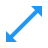 Scale type \(Only in ImageView\)

| Type | Explanation \(Source: abhiandroid.com\) |
| :--- | :--- |
| FIT\_XY | Fill the image from x and y coordinates of the container |
| FIT\_START | Scale the image from start of the container |
| FIT\_CENTER | Scale the image from center |
| FIT\_END | Scale the image from the end of the container |
| CENTER | Center the image but doesn’t scale the image |
| CENTER\_CROP | Scale the image uniformly |
| CENTER\_INSIDE | Center the image inside the container, rather than making the edge match exactly |

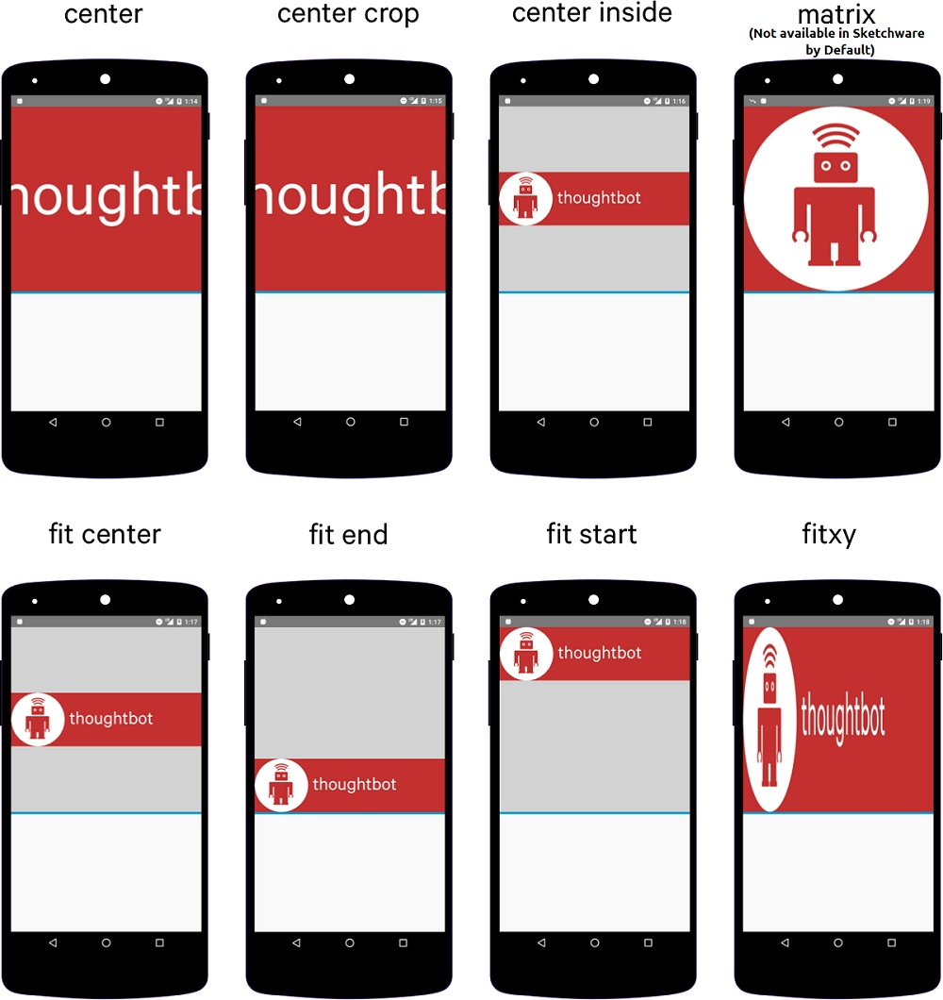

####  Background Resource

Background resource is used for setting custom background of the widget or layout. **You will need to** [**add image in Image Manager**](https://wiki.sketchub.in/configuration/image) **to set background image.**

#### \*\*\*\* **Background Color**

Used to set background color of the widget.

####  Enabled

| Values | Explanation |
| :--- | :--- |
| ON | Enables the widget, allowing codes and users to manipulate it. |
| OFF | Disables the widget, hence nobody will have access, even your codes \(until you don't enable it back\). |

####  Rotate

It rotates the widget with specific angle you give.

####  Translation X and Y

This is rarely used but important property, it moves the widget from its original position. For example, in this image \(Pic.8\), both widgets have -45 Y translation, which moves them horizontally.

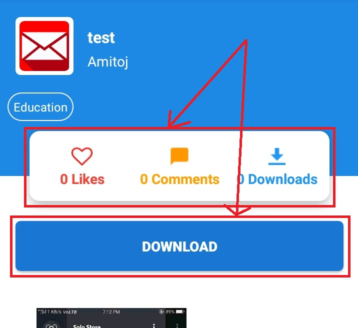

####  scaleX and scaleY

Scale is used to resize widgets; it also resizes the contents in it \(in linear layouts and scroll view\). It is not used usually in Sketchware because it stretches everything and make the UI worse if not used properly.

