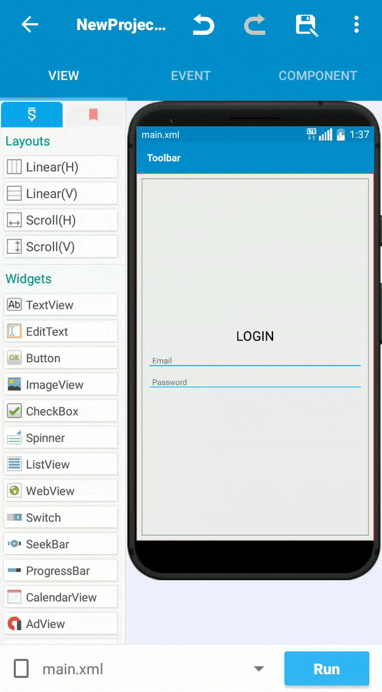
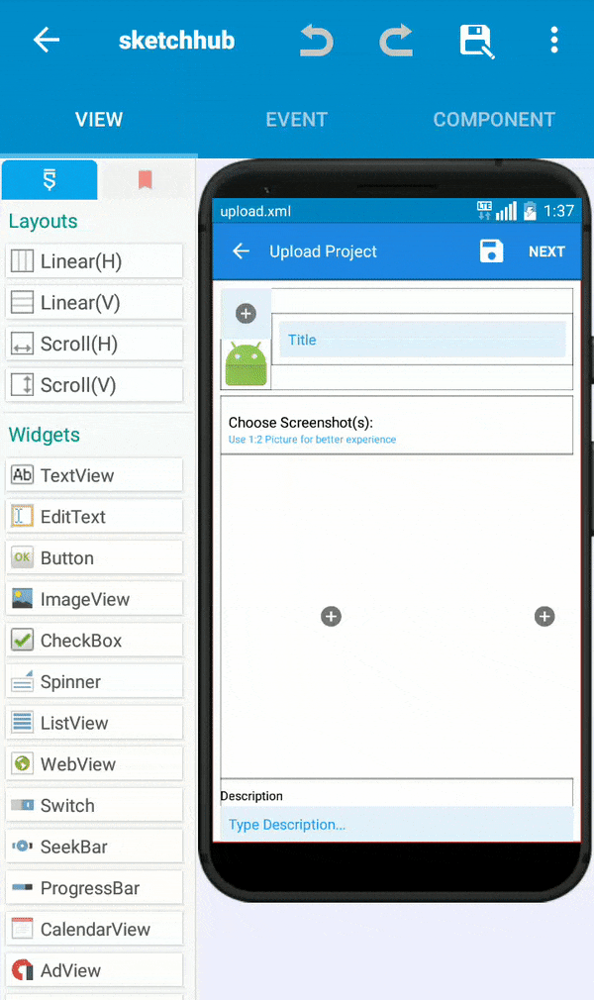

# Concept

Widgets and Layouts help to design your app. You can add available widgets just by dragging and dropping from the list as shown:

> Fact: When the project is compiled, all the views are translated into **XML**. To view translated XML, go to Open your Project &gt; Menu &gt; Show Source Code

## Layout

#### Linear Layout

By default, widgets are placed vertically on the screen. You can place widgets horizontally inside the Linear\(H\) layout and vertically inside the Linear\(V\) layout.


In "Pic.1", Linear \(V\) is used.


#### Scroll View

As the name suggests, contents in the scroll view are scrollable as shown:


A scroll view is a must-have for almost all apps.



If you are adding multiple contents in scroll view, it is necessary to add a linear layout and then your contents inside of it.


